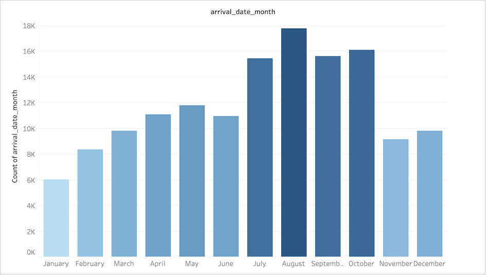
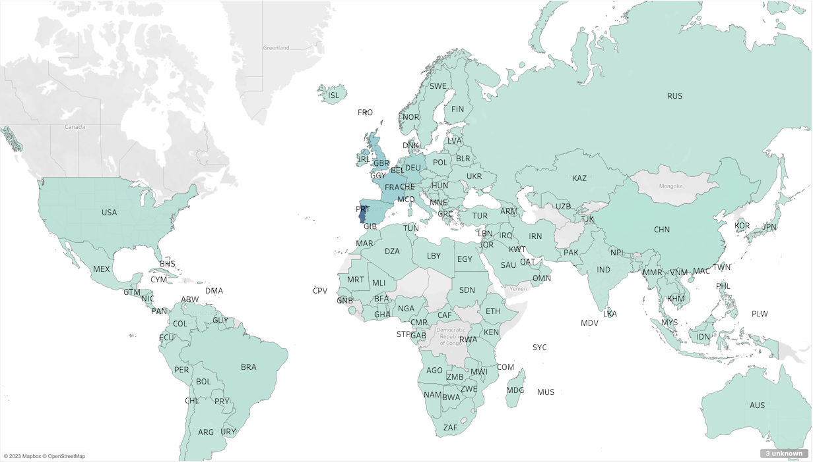
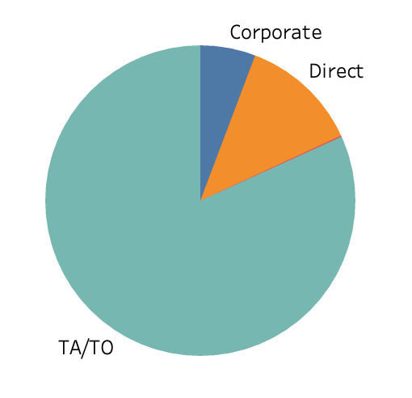
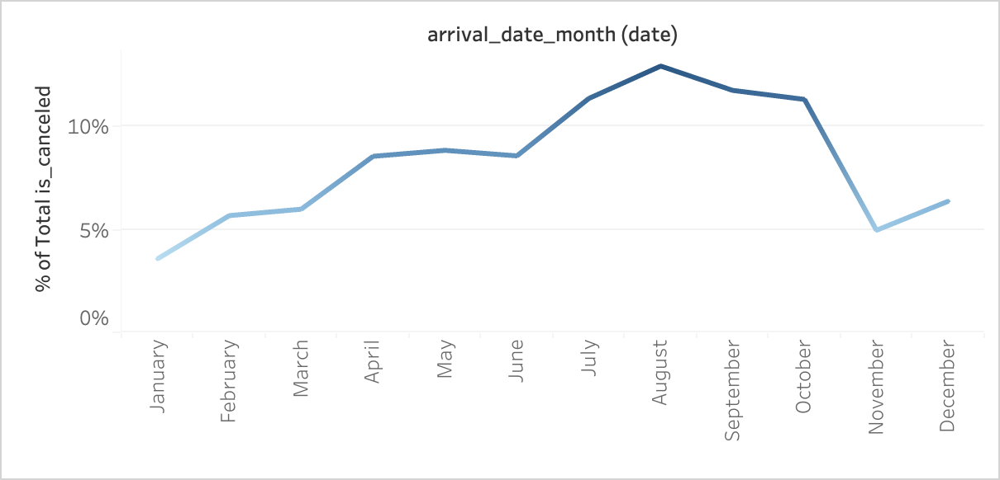
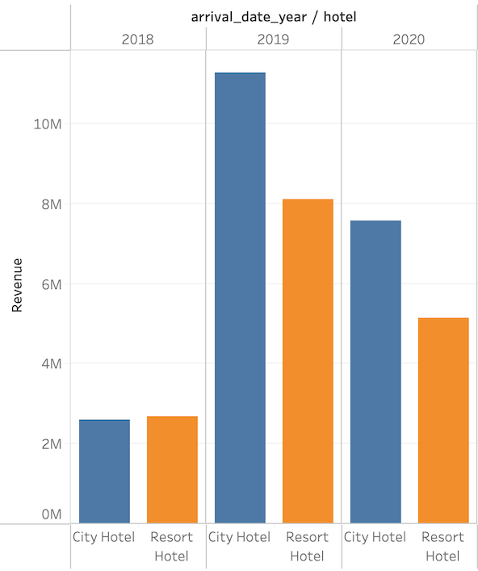

# Hotel Reservations Data Analysis

We have been provided data of reservations for a chain of hotels in the file hotel_revenue_historical_full.xlsx.

## Exploratory Analysis
We open the data file in Excel to take a quick look. There are 3 sheets for reservations data - one for each year 2018, 2019, and 2020. Fourth sheet has data for costs of meal types and the last one was market segment and their corresponding discounts.

In the reservations data, there are columns denoting type of hotel, average daily rate, number of week and weekend nights, final reservation status, type of meal requested, etc.

### Data cleaning
1. On applying filter to the hotel column in 2018 sheet, we see that there are 2 distinct values for it - City Hotel and Resort Hotel. Looking at the values, it seems they represent the type of hotel and not the hotel name. So we rename the column to be hotel_type in all 3 sheets to be more representative of the values.
2. Also renamed generic Cost column in meal_cost sheet to be meal_cost.
3. Lowercased all column names in meal_cost and market_segment sheets for consistency.
4. Noticed that 2018 sheet had some reservations from 2014. Deleted these outliers.

Next, load the Excel file into MS SQL server using Import and Export data feature and quickly check with following queries to make sure it is loaded properly:
```sql
select * from dbo.['2018$'];
select * from dbo.['2019$'];
select * from dbo.['2020$'];
select * from dbo.meal_cost$;
select * from dbo.market_segment$;
```

We had already noticed that the reservations are split by year into their own tables and thus it will be cumbersome to work with them separately. After verifying that columns in these 3 tables are same and we combine them with union in a CTE to create one unified table so that it is easier to work with.
```sql
with reservations as (
    select * from dbo.['2018$']
    union
    select * from dbo.['2019$']
    union
    select * from dbo.['2020$']
)

select count(*) from reservations;
```

We see that there are total of 100756 reservations across these 3 years. We will use this CTE for all our queries.

## Data Analysis
### Q1. Find trends for booking seasonality
```sql
select
	arrival_date_month,
	round(
		count(*) * 100.0 / (select count(*) from reservations)
	, 2) as booking_percentage
from reservations
group by arrival_date_month
order by booking_percentage desc;
```

| arrival_date_month | booking_percentage     |
|--------------------|------------------------|
| August             | 13.61                  |
| July               | 11.64                  |
| October            | 9.56                   |
| September          | 9.46                   |
| May                | 8.29                   |
| April              | 7.85                   |
| June               | 7.71                   |
| March              | 7.47                   |
| December           | 7.06                   |
| November           | 6.61                   |
| February           | 6.09                   |
| January            | 4.66                   |

We can see that Summer months are more popular for these hotels compared to Winter.

[](https://public.tableau.com/views/Hotel_16780075595590/Dashboard1?:language=en-US&:display_count=n&:origin=viz_share_link)

### Q2. What is demography of the customers? Citizens of which countries are visiting these hotels most?
```sql
select top 10
	country,
	count(*) as total_count
from reservations
group by country
order by total_count desc;
```

| country | total_count |
|---------|-------------|
| PRT     | 34234       |
| GBR     | 11551       |
| FRA     | 9823        |
| ESP     | 8593        |
| DEU     | 5757        |
| IRL     | 3415        |
| ITA     | 3400        |
| BEL     | 2254        |
| BRA     | 2130        |
| NLD     | 2093        |

We see that these hotels are most popular with customers from Portugal followed by Great Britain.

[](https://public.tableau.com/views/Hotel_16780075595590/Dashboard1?:language=en-US&:display_count=n&:origin=viz_share_link)

### Q3. What is the most popular meal type ordered by customers?
```sql
select
	r.meal,
    mc.meal_cost,
	count(*) as meal_count,
from reservations as r
left join dbo.meal_cost$ as mc on
	r.meal = mc.meal
group by r.meal, mc.meal_cost
order by meal_count desc
```

| meal      | meal_cost | meal_count |
|-----------|-----------|------------|
| BB        | 12.99     | 78938      |
| HB        | 17.99     | 10917      |
| SC        | 35.0      | 9872       |
| Undefined | 0.0       | 543        |
| FB        | 21.99     | 486        |


### Q4. What channels customers are using to make reservations?
```sql
select
    distribution_channel,
    round(
	    count(*) * 100.0 / (select count(*) from reservations)
    , 2) as channel_percentage
from reservations
group by distribution_channel
order by channel_percentage desc;
```
| distribution_channel | channel_percentage |
|----------------------|--------------------|
| TA/TO                | 78.55              |
| Direct               | 15.28              |
| Corporate            | 5.98               |
| GDS                  | 0.18               |
| Undefined            | 0.01               |

We see that close to 80% of the customers are booking through travel agents and about 15% are directly booking through the hotels.

[](https://public.tableau.com/views/Hotel_16780075595590/Dashboard1?:language=en-US&:display_count=n&:origin=viz_share_link)

We can also look at the output segemented by hotel type to see if we can get any different insight.
```sql
with reservations as (
    select * from dbo.['2018$']
    union
    select * from dbo.['2019$']
    union
    select * from dbo.['2020$']
),
hotel_type_count as (
	select hotel_type, count(*) as count from reservations
	group by hotel_type
)

select
	hotel_type,
    distribution_channel,
	round(
		count(*) * 100.0 /
		 (select hotel_type_count.count
		  from hotel_type_count
		  where reservations.hotel_type = hotel_type_count.hotel_type)
	, 2) as channel_percentage
from reservations
group by hotel_type, distribution_channel
order by hotel_type, channel_percentage desc;
```
| hotel_type   | distribution_channel | channel_percentage |
|--------------|----------------------|--------------------|
| City Hotel   | TA/TO                | 82.89              |
| City Hotel   | Direct               | 11.80              |
| City Hotel   | Corporate            | 5.00               |
| City Hotel   | GDS                  | 0.30               |
| City Hotel   | Undefined            | 0.01               |
| Resort Hotel | TA/TO                | 72.16              |
| Resort Hotel | Direct               | 20.41              |
| Resort Hotel | Corporate            | 7.43               |
| Resort Hotel | Undefined            | 0.00               |

We see similar trend across distribution channels with Travel Agent bookings on top followed by Direct but notice that direct bookings for Resort Hotels is almost double of City Hotels!

### Q5. What is the cancellation rate? Which distribution channels have more cancellations? Find trend for this month over month.

```sql
select
	round(
		sum(is_canceled) * 100.0 / count(*)
	, 2) as cancel_percentage
from reservations;
```
We see that the overall cancellation rate is 26.58%. Now lets segment this by hotel_type.

```sql
select
	hotel_type,
	round(
		sum(is_canceled) * 100.0 / count(*)
	, 2) as cancel_percentage
from reservations
group by hotel_type
order by hotel_type, cancel_percentage desc;
```

| hotel_type   | cancel_percentage |
|--------------|-------------------|
| City Hotel   | 29.13             |
| Resort Hotel | 22.82             |

Cancellation rate for City Hotels is much higher! Now lets checkout how are these cancellations spread different distribution channels.

```sql
with reservations as (
    select * from dbo.['2018$']
    union
    select * from dbo.['2019$']
    union
    select * from dbo.['2020$']
),
hotel_type_count as (
	select hotel_type, count(*) as total_count, sum(is_canceled) as canceled_count from reservations
	group by hotel_type
)

select
	hotel_type,
    distribution_channel,
	round(
		sum(is_canceled) * 100.0 /
		 (select hotel_type_count.canceled_count
		  from hotel_type_count
		  where reservations.hotel_type = hotel_type_count.hotel_type)
	, 2) as cancel_percentage
from reservations
group by hotel_type, distribution_channel
order by hotel_type, cancel_percentage desc;
```

| hotel_type   | distribution_channel | cancel_percentage |
|--------------|----------------------|-------------------|
| City Hotel   | TA/TO                | 91.12             |
| City Hotel   | Direct               | 6.37              |
| City Hotel   | Corporate            | 2.26              |
| City Hotel   | GDS                  | 0.21              |
| City Hotel   | Undefined            | 0.05              |
| Resort Hotel | TA/TO                | 83.47             |
| Resort Hotel | Direct               | 12.41             |
| Resort Hotel | Corporate            | 4.12              |
| Resort Hotel | Undefined            | 0.00              |

An interesting thing we notice here that direct bookings for resort hotels have double the chance of getting canceled than direct bookings at city hotels.

Now lets see how do these cancellations vary across months.
```sql
select
	arrival_date_month,
	round(
		sum(is_canceled) * 100.0 / count(*)
	, 2) as cancel_percentage
from reservations
group by arrival_date_month
order by cancel_percentage desc;
```

| arrival_date_month | cancel_percentage |
|--------------------|-------------------|
| July               | 31.63             |
| August             | 30.59             |
| April              | 30.46             |
| June               | 30.32             |
| May                | 29.23             |
| December           | 24.60             |
| March              | 24.46             |
| February           | 23.67             |
| September          | 23.17             |
| January            | 22.12             |
| October            | 21.61             |
| November           | 19.47             |

It seems cancellations for Summer months are much higher than Winter ones. This trend is similar to the reservations by month.

[](https://public.tableau.com/views/Hotel_16780075595590/Dashboard1?:language=en-US&:display_count=n&:origin=viz_share_link)

### Q6. What is the revenue for these hotels? Segment by year and type of hotel
From the data, we can infer that revenue for each reservation can be calculated as number of nights x discounted rate if the reservation is not canceled.

```sql
select
    arrival_date_year,
    hotel_type,
    round(
        sum((stays_in_week_nights + stays_in_weekend_nights) * (adr * (1 - discount)))
    , 2) as revenue
from reservations as r
left join dbo.market_segment$ as ms
    on r.market_segment = ms.market_segment
group by is_canceled, arrival_date_year, hotel_type
having is_canceled = 0
order by arrival_date_year, hotel_type
```

| arrival_date_year | hotel_type   | revenue    |
|-------------------|--------------|------------|
| 2018              | City Hotel   | 1029003.09 |
| 2018              | Resort Hotel | 1821641.96 |
| 2019              | City Hotel   | 5350520.95 |
| 2019              | Resort Hotel | 5197386.30 |
| 2020              | City Hotel   | 3603007.07 |
| 2020              | Resort Hotel | 2979002.88 |

NOTE: Numbers in this visualization are slightly higher since Tableau's Union apparently works different from SQL server's union.
[](https://public.tableau.com/views/Hotel_16780075595590/Dashboard1?:language=en-US&:display_count=n&:origin=viz_share_link)